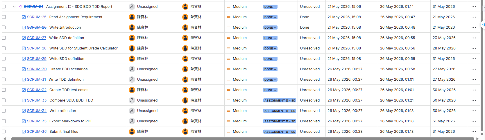
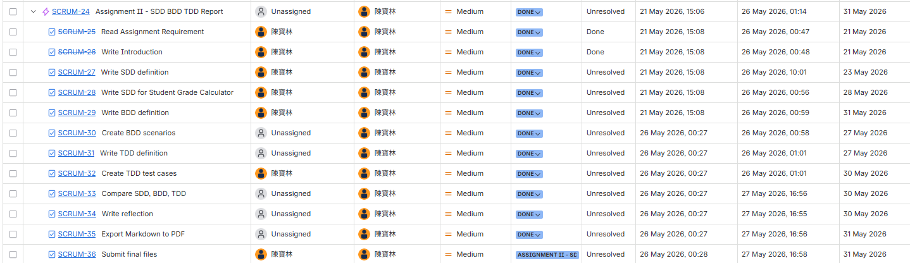

# Assignment II: SDD, BDD, and TDD in AI-Assisted Software Development

## Student Information

- Name: 陳寶林
- Student ID: 1113540
- Course: CS351 AI-assisted Software Development
- Date: 2026/05/226

---

# 1. Introduction

With the rapid development of artificial intelligence technologies, AI-assisted software development has become increasingly common in modern software engineering practices. AI tools can help developers generate code, documentation, testing ideas, and software design solutions more efficiently. However, AI systems cannot fully understand developer intentions without clear instructions and structured guidance.

Because of this limitation, software development approaches such as Specification-Driven Development (SDD), Behavior-Driven Development (BDD), and Test-Driven Development (TDD) remain highly important in the AI era. These approaches help developers communicate requirements, expected behaviors, and validation conditions more clearly to both human developers and AI systems.

This assignment applies SDD, BDD, and TDD to the Student Grade Calculator scenario. Through this exercise, the report demonstrates how structured software development approaches can improve requirement clarity, reduce ambiguity, and increase the reliability of AI-assisted software development workflows.

---

# 2. Definition of SDD

Specification-Driven Development (SDD) is a software development approach that focuses on defining detailed system specifications before implementation begins. Instead of immediately generating code, SDD emphasizes identifying the system goal, required inputs, expected outputs, business rules, constraints, and acceptance criteria.

The main objective of SDD is to reduce misunderstanding during development by providing a clear description of what the system should do. In AI-assisted software development, SDD is especially important because AI-generated outputs strongly depend on the quality and clarity of the provided specifications. Clear specifications help developers and AI systems maintain a shared understanding of the development requirements.

---

# 3. SDD: Student Grade Calculator

## 3.1 Goal

The purpose of the Student Grade Calculator is to calculate a student’s final academic result based on multiple evaluation components. The system should provide accurate score calculation and assign the correct letter grade according to predefined grading policies.

---

## 3.2 Functional Requirements

- The system should allow users to enter assignment, midterm exam, final exam, and project scores.
- The calculator should automatically compute the weighted final score.
- The system should determine the correct letter grade based on the final score.
- The system should clearly display both the final score and the assigned letter grade.
- The system should validate whether all input scores are within the acceptable range before calculation.

---

## 3.3 Input

The system requires four numerical inputs:

- Assignment score (0–100)
- Midterm exam score (0–100)
- Final exam score (0–100)
- Project score (0–100)

---

## 3.4 Output

The system should display:

- Final weighted score
- Assigned letter grade
- Error message for invalid input values

---

## 3.5 Grade Rules

The final score is calculated using the following weighted formula:

Final Score = Assignment × 0.30 + Midterm × 0.20 + Final Exam × 0.30 + Project × 0.20

The grading policy is defined as follows:

- A: 90.0–100.0
- B: 80.0–89.9
- C: 70.0–79.9
- D: 60.0–69.9
- F: Below 60.0

The final score should be rounded to one decimal place before displaying the result.

---

## 3.6 Acceptance Criteria

- The system must calculate the weighted score using the correct percentage for each evaluation component.
- The calculator must assign the correct letter grade after rounding the final score.
- The system should reject scores lower than 0 or higher than 100.
- The calculation process should not continue if any required score is missing.
- The displayed result should clearly show both the final score and the assigned letter grade.

---

# 4. Definition of BDD

Behavior-Driven Development (BDD) is a software development approach that focuses on describing system behavior from the user’s perspective. Instead of only defining technical specifications, BDD explains how the system should behave in real usage situations.

BDD commonly uses the Given–When–Then structure to describe conditions, actions, and expected outcomes. This format improves communication between developers, testers, and stakeholders because software behavior becomes easier to understand.

In AI-assisted software development, BDD helps developers provide clearer behavioral instructions to AI systems. Well-defined scenarios can reduce ambiguity and improve the accuracy of AI-generated solutions.

---

# 5. BDD: Student Grade Calculator

## Scenario 1: Final score is correctly assigned as grade A

Given the assignment score is 92  
And the midterm exam score is 87  
And the final exam score is 90  
And the project score is 91  

When the system calculates the final result  

Then the final score should be 90.1  
And the letter grade should be A  

---

## Scenario 2: Invalid input score is rejected

Given the assignment score is 84  
And the midterm exam score is 108  
And the final exam score is 79  
And the project score is 86  

When the system validates the input data  

Then the calculation should not continue  
And the system should display an invalid score error message  

---

# 6. Definition of TDD

Test-Driven Development (TDD) is a software development approach in which test cases are designed before implementation begins. The main objective of TDD is to verify system correctness through systematic testing.

The TDD process is commonly divided into three stages. The first stage is Red, where developers create a test that initially fails because the functionality has not yet been implemented. The second stage is Green, where developers create the simplest implementation necessary to pass the test. The final stage is Refactor, where the implementation is improved while maintaining successful test results.

In AI-assisted software development, TDD is especially valuable because AI-generated outputs may contain hidden logical or calculation errors. Well-designed test cases help developers verify whether the generated implementation truly satisfies the expected requirements and behaviors.

---

# 7. TDD: Student Grade Calculator

## Scenario 1: Normal Test Cases

### Test Case 1

#### Input
- Assignment: 86
- Midterm: 82
- Final Exam: 91
- Project: 88

#### Expected Calculation

Final Score = (86 × 0.30) + (82 × 0.20) + (91 × 0.30) + (88 × 0.20)

Final Score = 87.1

#### Expected Output
- Final Score: 87.1
- Letter Grade: B

---

### Test Case 2

#### Input
- Assignment: 74
- Midterm: 76
- Final Exam: 71
- Project: 79

#### Expected Calculation

Final Score = (74 × 0.30) + (76 × 0.20) + (71 × 0.30) + (79 × 0.20)

Final Score = 74.6

#### Expected Output
- Final Score: 74.6
- Letter Grade: C

---

## Scenario 2: Boundary Test Cases

### Test Case 1

#### Input
- Assignment: 89
- Midterm: 90
- Final Exam: 91
- Project: 90

#### Expected Calculation

Final Score = (89 × 0.30) + (90 × 0.20) + (91 × 0.30) + (90 × 0.20)

Final Score = 90.0

#### Expected Output
- Final Score: 90.0
- Letter Grade: A

---

### Test Case 2

#### Input
- Assignment: 60
- Midterm: 61
- Final Exam: 59
- Project: 60

#### Expected Calculation

Final Score = (60 × 0.30) + (61 × 0.20) + (59 × 0.30) + (60 × 0.20)

Final Score = 59.9

#### Expected Output
- Final Score: 59.9
- Letter Grade: F

---

## Scenario 3: Invalid Input Test Cases

### Test Case 1

#### Input
- Assignment: -8
- Midterm: 80
- Final Exam: 77
- Project: 91

#### Expected Calculation

Calculation should not proceed.

#### Expected Output
- Error message: Invalid assignment score

---

### Test Case 2

#### Input
- Assignment: 88
- Midterm: 102
- Final Exam: 84
- Project: 90

#### Expected Calculation

Calculation should not proceed.

#### Expected Output
- Error message: Invalid midterm exam score

---

# 8. Comparison of SDD, BDD, and TDD

| Item | SDD | BDD | TDD |
|---|---|---|---|
| Full Name | Specification-Driven Development | Behavior-Driven Development | Test-Driven Development |
| Main Focus | System requirements and specifications | User behavior and expected interactions | Testing and validation |
| Main Question | What should the system do? | How should the system behave? | How can correctness be verified? |
| Typical Format | Structured requirement descriptions | Given–When–Then scenarios | Test cases and expected outputs |
| Main Advantage | Reduces unclear requirements | Improves communication between stakeholders | Detects errors early |
| AI-era Benefit | Helps AI understand development goals clearly | Helps AI generate behavior-based solutions | Verifies whether AI-generated results are correct |
| Development Perspective | Requirement-oriented | User-oriented | Quality-oriented |

---

# 9. Reflection

Among SDD, BDD, and TDD, I think SDD is the easiest approach to understand because it focuses on clearly defining requirements before development begins. It provides a structured overview of the system, including inputs, outputs, constraints, and expected results. This makes the overall development direction easier to understand from the beginning.

However, I believe TDD is the most useful approach when working with AI coding tools. AI-generated outputs may sometimes appear convincing even when hidden logical or calculation errors still exist. Because of this, testing and validation become especially important in AI-assisted development environments. By preparing test cases before implementation, developers can verify whether the generated result truly satisfies the expected behavior and grading rules.

BDD is also valuable because it helps describe the system from the user’s perspective. The Given–When–Then structure makes software behavior easier to communicate and understand. In AI-assisted development, behavioral descriptions can reduce misunderstandings between developers and AI systems.

Through this assignment, I also learned that unclear prompts can easily produce inaccurate AI-generated outputs. SDD helps reduce this problem by defining detailed requirements before implementation begins. At the same time, TDD provides a method for checking whether the generated result is reliable, while BDD helps ensure that the system behavior matches user expectations.

In future software projects, I would combine SDD, BDD, and TDD together. I would first define clear specifications using SDD, then describe expected user behaviors with BDD, and finally create test cases with TDD to validate the final implementation. Combining these three approaches can improve both software quality and the reliability of AI-assisted software engineering workflows.

---

# 10. References / AI Tool Usage

- ChatGPT,  was used to help understand the concepts of SDD, BDD, and TDD.
- AI assistance copilot was used for idea organization and academic writing support.
- Jira Scrum Board was used to organize assignment tasks and workflow management.
- The final report structure, examples, and explanations were reviewed and modified by the student.

## Reference Websites

- https://github.com/yfhuang/YZUCSE_CS351/tree/main/Assignment/AssignmentII

---

# 11. Appendix: Jira Workflow Evidence

To organize the assignment workflow, Jira was used to manage and track the progress of different report tasks. The tasks were divided into smaller development activities, including requirement analysis, writing SDD and BDD sections, designing TDD test cases, writing the reflection section, exporting the PDF report, and preparing the final submission.

The Jira List view helped monitor task organization, task status, and assignment progress in a structured way. This workflow reflects how software development activities can be planned and managed in AI-assisted software engineering projects.

## Jira Task Management

## Jira Task Management (Done)

